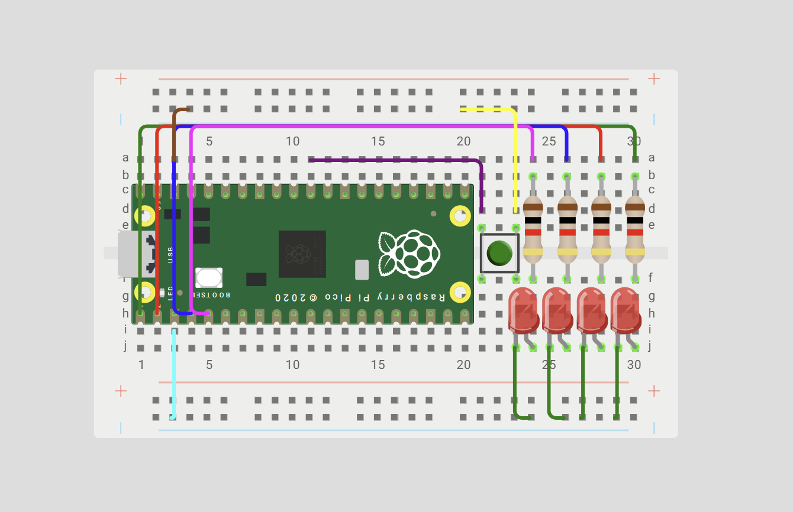

# Block 1 - GPIO 

**Goal:** to understand and control GPIO peripherals through memory-mapped registers, bitwise operations, masks, and RP2350 SIO registers.

## What I Learned

In this practice, I learned how to control the GPIO pins of the RP2W and how each register affects their behavior. I also learned how binary numbers and masks can be used to control specific pins, and how the << operation moves bits to create the value needed. Finally, I understood better how the Pico SDK functions work and how they are connected to the SIO registers.


## Circuit assembly for the exercises


## Exercise 1 — 4 bit binary counter
Use the four LEDs as a 4-bit binary number.

`The program must count: 1 → 2 → 3 → ... → 15 → 0`

### What I did 

At the beginning, Gio and I were a little confused about the theory behind the exercise, so we asked ChatGPT for an example code to help us understand it. The code worked, but it was quite different from what our teacher later explained in class. After going over the concepts again, especially binary numbers and masks, we were able to write our own code.

Code gived by Chatgpt:
```  
  while (true) {
        // Apagar todos los LEDs
        sio_hw->gpio_clr = MASK;
        // Encender los LEDs según el número binario
        sio_hw->gpio_set = number;
        // Esperar
        sleep_ms(500);
        // Siguiente número
        number++;
        // Regresar a 0 después de 15
        if (number > 15) {
            number = 0;
        }
```  

Code made by ourselfs:
```  
sio_hw->gpio_set = (counter);
sleep_ms(200);
sio_hw->gpio_clr = (0b1111<<0);
sleep_ms(200);
counter++; 
```  

### **Video**
<iframe width="560" height="315" src="https://www.youtube.com/embed/Q7dsG-ETAew?si=7dKkriQLZ3vq-5zB" title="YouTube video player" frameborder="0" allow="accelerometer; autoplay; clipboard-write; encrypted-media; gyroscope; picture-in-picture; web-share" referrerpolicy="strict-origin-when-cross-origin" allowfullscreen></iframe>

## Exercise 2 — Bouncing light
Create a light that moves across the four LEDs and then returns. 

### What I did

For this exercise, we went over the theory again and understood better how to move the bits between the four LEDs. With this, we were able to create the code ourselves.

Code: 
``` 
   while (true) 
   {for(pos=0;pos<=3;pos++)
    {  sio_hw->gpio_set = (1u<<pos);
       sleep_ms(200);
       sio_hw->gpio_clr = (1u<<pos);
       sleep_ms(200);
    }
    for(pos=3;pos>=0;pos--)
    {  sio_hw->gpio_set = (1u<<pos);
       sleep_ms(200);
       sio_hw->gpio_clr = (1u<<pos);
       sleep_ms(200);
    }
    }
``` 
### **Video**
<iframe width="560" height="315" src="https://www.youtube.com/embed/Hz5yY8PzAKI?si=VSz3jlO33kRY7W3u" title="YouTube video player" frameborder="0" allow="accelerometer; autoplay; clipboard-write; encrypted-media; gyroscope; picture-in-picture; web-share" referrerpolicy="strict-origin-when-cross-origin" allowfullscreen></iframe>

## Exercise 3 — Fill and empty animation
Create an animation that progressively fills all four LEDs and then progressively empties them.

### What I did
For this exercise, we reviewed the theory again and understood how the masks could be used to control each LED. Instead of using a counter like in the previous exercises, we decided to turn each LED on and off individually using binary values. This made the sequence easier for us to understand and follow.

Code:
``` 
sio_hw->gpio_set = 0b0001;
sleep_ms(200);
sio_hw->gpio_set = 0b0010;
sleep_ms(200);
sio_hw->gpio_set = 0b0100;
sleep_ms(200);
sio_hw->gpio_set = 0b1000;
sleep_ms(200);

sio_hw->gpio_clr = 0b1000;
sleep_ms(200);
sio_hw->gpio_clr = 0b0100;
sleep_ms(200);
sio_hw->gpio_clr = 0b0010;
sleep_ms(200);
sio_hw->gpio_clr = 0b0001;
sleep_ms(200);
``` 

### **Video**
<iframe width="560" height="315" src="https://www.youtube.com/embed/zvCyZKG_jzU?si=4RI2UiFp2iaTjj68" title="YouTube video player" frameborder="0" allow="accelerometer; autoplay; clipboard-write; encrypted-media; gyroscope; picture-in-picture; web-share" referrerpolicy="strict-origin-when-cross-origin" allowfullscreen></iframe>

## Exercise 4 — Fill from the outside inward
Create an animation that progressively fills all four LEDs and then progressively empties them.

### What I did 
For this exercise, we used what we had learned about binary masks to control more than one LED at the same time. We first turned on the two LEDs on the outside using 1001, and then the two LEDs in the middle using 0110. After that, we turned them off in the same order.

Code:
``` 
   while (true) {
   sio_hw->gpio_set = 0b1001;  
    sleep_ms(200);
    sio_hw->gpio_set = 0b0110;  
    sleep_ms(200);

    sio_hw->gpio_clr = 0b1001;  
    sleep_ms(200);
    sio_hw->gpio_clr = 0b0110;   
    sleep_ms(200); }
``` 

### **Video**
<iframe width="560" height="315" src="https://www.youtube.com/embed/gMO9P1rv6QY?si=1lvuD-RQE6oLm1Rq" title="YouTube video player" frameborder="0" allow="accelerometer; autoplay; clipboard-write; encrypted-media; gyroscope; picture-in-picture; web-share" referrerpolicy="strict-origin-when-cross-origin" allowfullscreen></iframe>

### Diclosure 


