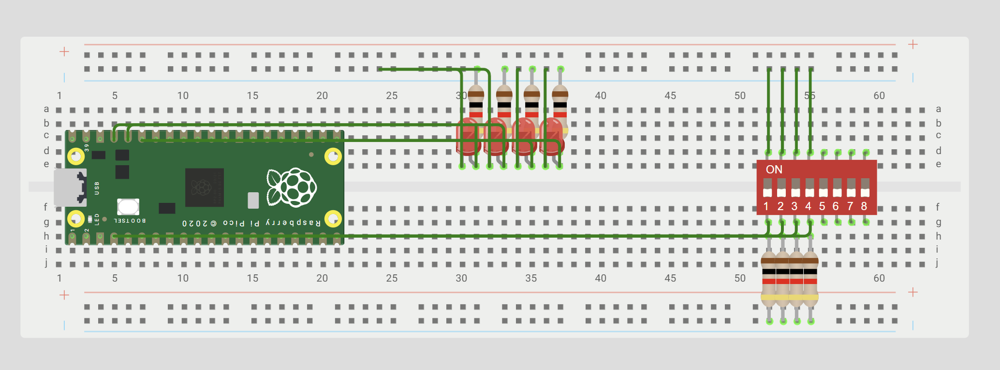

# Digital inputs

**Goal:** Learn how to configure and use digital inputs on the Raspberry Pi Pico 2 understanding pull-ups, pull-downs and debounce techniques to correctly read buttons and avoid unstable signals.

---

## What I learned

In this practice, I learned how to configure and use digital inputs on the Raspberry Pi Pico 2 to read the state of a button. I also learned how pull-up and pull-down resistors prevent inputs from floating and how the input can be read as a high or low logic level. Finally, I understood the importance of debounce and how it helps avoid false readings caused by the mechanical bouncing of a button.

---

## Circuit assembly for the exercises


## Exercise 1 - AND

### What I did 

Code:
```  
while (true) {
        // With an (external) pull-up, pressed = 0 (low level)
        if ((sio_hw->gpio_in & SW0_BIT && sio_hw->gpio_in & SW1_BIT )) {
            sio_hw->gpio_set = LED_AND_BIT;   // LED on
            printf("ON");
        } else {
            sio_hw->gpio_clr = LED_AND_BIT;   // LED Off
            print

```  
### **Video**

<iframe width="560" height="315" src="https://www.youtube.com/embed/rilfPv1joAg?si=qmqgm0HywIDT9_bu" title="YouTube video player" frameborder="0" allow="accelerometer; autoplay; clipboard-write; encrypted-media; gyroscope; picture-in-picture; web-share" referrerpolicy="strict-origin-when-cross-origin" allowfullscreen></iframe>

## Exercise 2 - OR

### What I did 

Code:
```  
while (true) {
        // With an (external) pull-up, pressed = 0 (low level)
        if ((sio_hw->gpio_in & SW0_BIT || sio_hw->gpio_in & SW1_BIT )) {
            sio_hw->gpio_set = LED_OR_BIT;   // LED on
            printf("ON");
        } else {
            sio_hw->gpio_clr = LED_OR_BIT;   // LED Off
            printf("OFF");
        }

```  
### **Video**

<iframe width="560" height="315" src="https://www.youtube.com/embed/JCdVKcYEekI?si=hLpyJ5z0J91KImnw" title="YouTube video player" frameborder="0" allow="accelerometer; autoplay; clipboard-write; encrypted-media; gyroscope; picture-in-picture; web-share" referrerpolicy="strict-origin-when-cross-origin" allowfullscreen></iframe>

## Exercise 3 - XOR

### What I did 

Code:
```  
    while (true) {
        // With an (external) pull-up, pressed = 0 (low level)
        if ((sio_hw->gpio_in & SW0_BIT) && !(sio_hw->gpio_in & SW1_BIT )) {
            sio_hw->gpio_set = LED_XOR_BIT;   // LED on
            printf("ON");
        }
        else if (!(sio_hw->gpio_in & SW0_BIT) && (sio_hw->gpio_in & SW1_BIT ))
        {
            sio_hw->gpio_set = LED_XOR_BIT;   // LED on
            printf("ON");
        }        
        else {
            sio_hw->gpio_clr = LED_XOR_BIT;   // LED Off
            printf("OFF");
        }
        sleep_ms(100);
 
```  
### **Video**

<iframe width="560" height="315" src="https://www.youtube.com/embed/XBOCYfJYCi4?si=FX9pxb4ilZyHGAkv" title="YouTube video player" frameborder="0" allow="accelerometer; autoplay; clipboard-write; encrypted-media; gyroscope; picture-in-picture; web-share" referrerpolicy="strict-origin-when-cross-origin" allowfullscreen></iframe>

## Exercise 4 - 

### What I did 

Code:
```  
while (true) {
    // With an external pull-up, pressed = 0 (low level)
    if (!(sio_hw->gpio_in & (1u << PIN_BA)) && (flag == 0)) {
        counter++;
        flag = 1;
        sio_hw->gpio_clr = MASK;
    }
    else if (!(sio_hw->gpio_in & (1u << PIN_BB)) && (flag == 0)) {
        counter--;
        flag = 1;
        sio_hw->gpio_clr = MASK;
    }
    else if ((sio_hw->gpio_in & (1u << PIN_BA)) &&
             (sio_hw->gpio_in & (1u << PIN_BB))) {
        flag = 0;
    }
    if (counter > 3) {
        counter = 0;
    }
    else if (counter < 0) {
        counter = 3;
    }
    sio_hw->gpio_set = (1u << (counter + 10));
    sleep_ms(100);
}
 
```  
### **Video**

<iframe width="560" height="315" src="https://www.youtube.com/embed/eUvwro2iH7g?si=nyCovm18Fm0YI6Qa" title="YouTube video player" frameborder="0" allow="accelerometer; autoplay; clipboard-write; encrypted-media; gyroscope; picture-in-picture; web-share" referrerpolicy="strict-origin-when-cross-origin" allowfullscreen></iframe>

### What could have gone better

Even though all of our codes worked correctly, I think we could have experimented more with the circuit and the program to better understand how everything works. This would have helped us feel more confident with the code instead of mainly focusing on getting the expected result. 

### Conclusion

Overall, this practice helped us understand better how digital inputs work and how buttons can be used to control the GPIO pins of the Raspberry Pi Pico 2. At first, we were a little confused about pull-ups, pull-downs, and debounce, but after reviewing the theory and testing the code, we were able to read the button states correctly. It also helped us understand the importance of avoiding floating inputs and made us more comfortable working with digital inputs and the RP2350.

---