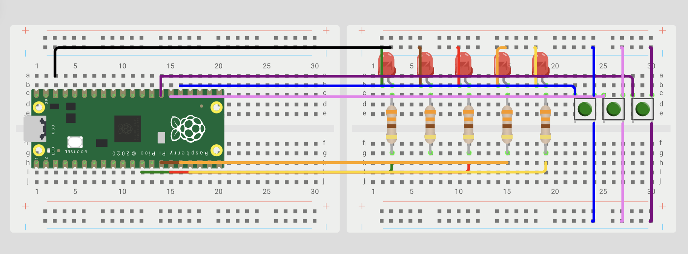

# Interrupts

**Goal:** to understand how interrupts work on the RP2350, including IRQs, ISRs, GPIO interrupts, priorities, and how they allow the microcontroller to respond to events without constantly checking the inputs.

---

## What I learned

In this practice, I learned how interrupts allow the RP2350 to respond to events without continuously checking the GPIO inputs. I also learned how ISRs, IRQs, and the NVIC work together to handle interrupts, and how GPIO interrupts can be triggered by rising or falling edges. Finally, I understood how to configure GPIO interrupts using the Pico SDK and why it is important to acknowledge the interrupt and keep the ISR as short as possible.

---

## Circuit assembly for the exercises



## Roulette 

### What I did 
For this exercise, we created a roulette using five LEDs that turned on in sequence from one side to the other and then back again. We added one button to increase the speed and another button to decrease it. Finally, we used a third button that, when pressed while the middle LED was on, turned on all five LEDs before continuing with the sequence.

Code

```  
 
volatile int pos = 0;
volatile int vel=200;
const uint32_t MASK = (1u<<led1) | (1u<<led2) | (1u<<led3) | (1u<<led4)  | (1u<<led5) ;
 
static void FUNCION_STOP(uint GPIO, uint32_t event){
    if(GPIO == Btn1 && event==GPIO_IRQ_EDGE_RISE ){
        printf("botonok \n");
        if(pos==2){
            printf("ganaste\n");
            for(int i=0;i<3;i++){
                sio_hw->gpio_set = MASK;
                busy_wait_ms(100);
                sio_hw->gpio_clr =MASK;
                busy_wait_ms(100);
            }
        }
    }
     if(GPIO == Btn2 && event == GPIO_IRQ_EDGE_RISE){
        vel -= 30;
        if(vel < 40) vel = 40; // límite para que no quede absurdo
        printf("velocidad: %d\n", vel);
    }
        if(GPIO == Btn3 && event == GPIO_IRQ_EDGE_RISE){
        vel += 30;
        if(vel > 500) vel = 500; // límite para que no quede eterno
        printf("velocidad: %d\n", vel);
    }
    gpio_acknowledge_irq(GPIO, event);
}

   int pause=0;
   int counter =0;
   int dir = 1;       // Dirección: 1→derecha, -1→izquierda
   //FUNCIO NDE INTERR
   gpio_set_irq_enabled_with_callback(Btn1,GPIO_IRQ_EDGE_RISE,true,&FUNCION_STOP);
   gpio_set_irq_enabled(Btn2, GPIO_IRQ_EDGE_RISE, true);
   gpio_set_irq_enabled(Btn3, GPIO_IRQ_EDGE_RISE, true);
   
   while (true) {
        for(pos=0;pos<=4;pos++)
      { sio_hw->gpio_set = (1u<<pos+9);
       sleep_ms(vel);
       sio_hw->gpio_clr = (1u<<pos+9);
       sleep_ms(vel);}
    for(pos=4;pos>=0;pos--)
      { sio_hw->gpio_set = (1u<<pos+9);
       sleep_ms(vel);
       sio_hw->gpio_clr = (1u<<pos+9);
       sleep_ms(vel);}
   }
}

```  

### **Video**

<iframe width="560" height="315" src="https://www.youtube.com/embed/HhzLsmht66k?si=Mi76epTDMk2EnSfF" title="YouTube video player" frameborder="0" allow="accelerometer; autoplay; clipboard-write; encrypted-media; gyroscope; picture-in-picture; web-share" referrerpolicy="strict-origin-when-cross-origin" allowfullscreen></iframe>

### What could have gone better
At first, the buttons for increasing and decreasing the speed were not working as expected. After testing and changing different parts of the code, I realized that I needed to remove the speed value controlled by the vel variable that we had previously declared as volatile. Once I made this change, the buttons worked correctly and I was able to control the speed as intended.

### Conclusion
Overall, this practice helped us understand better how interrupts can be used to control different actions without constantly checking the buttons. At first, we had some problems getting the speed buttons to work, but after testing the code, we found the issue and were able to fix it. Creating the LED roulette also helped us understand how multiple interrupts and variables can work together to control the sequence, speed, and special action of the LEDs.

